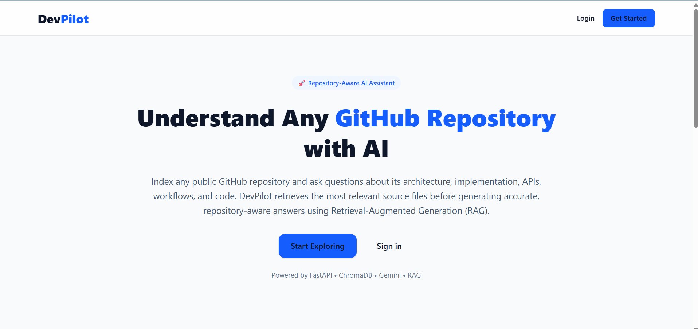
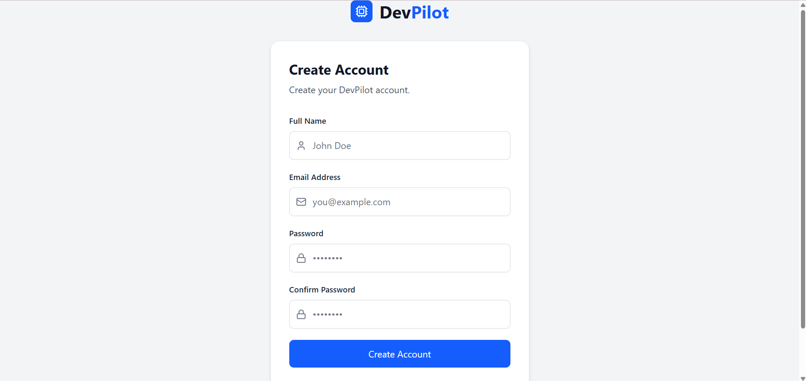
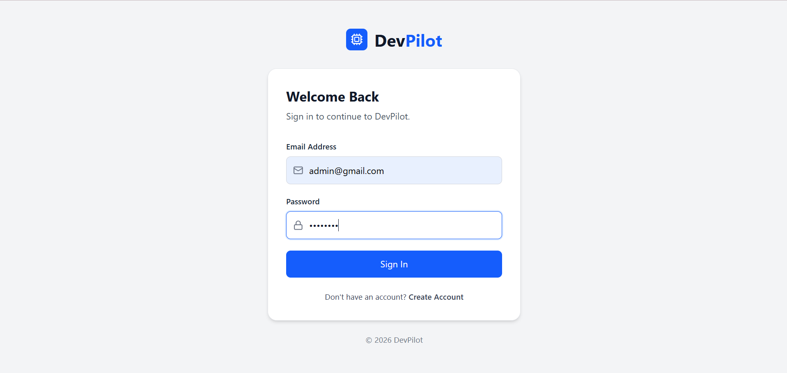
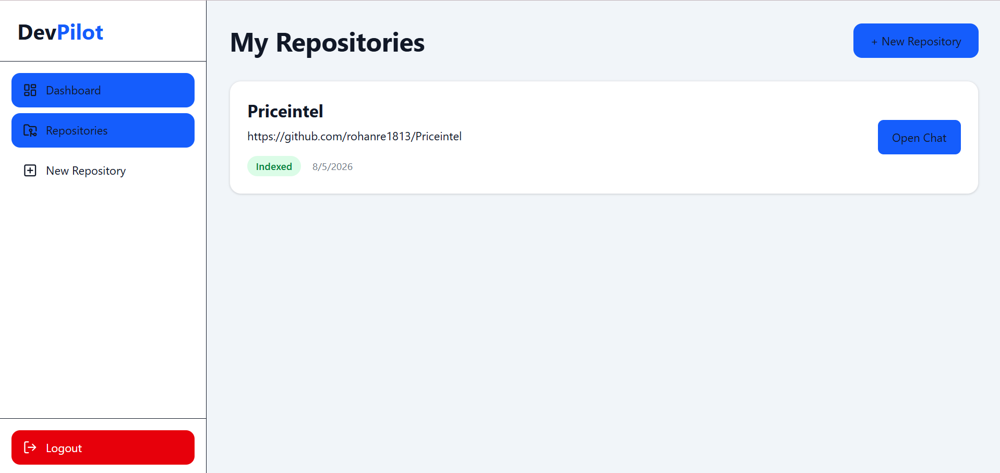
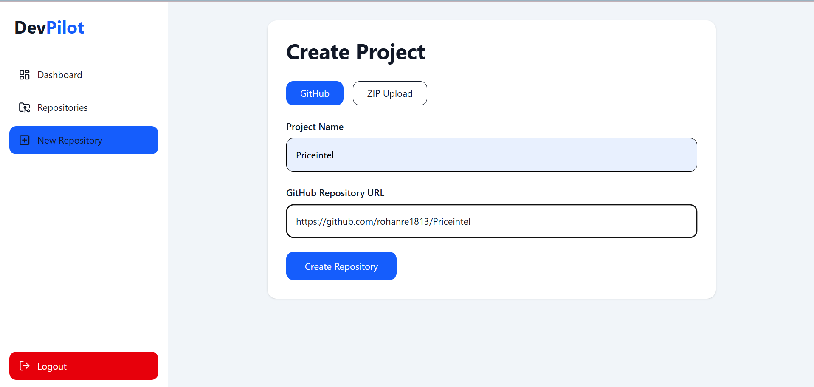
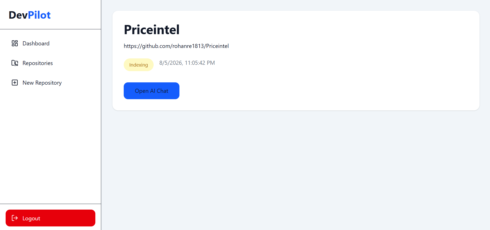
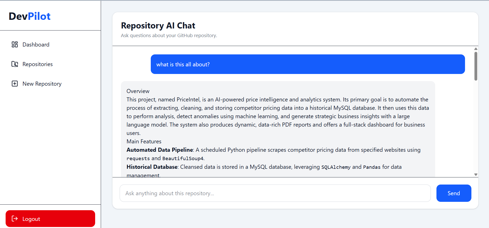

# DevPilot — Intelligent Codebase Explorer

DevPilot is a full-stack application that lets developers import a GitHub repository or upload a ZIP project and ask questions about the codebase.

It indexes the repository, creates embeddings for code chunks, stores them in ChromaDB, retrieves relevant code for a question, and uses Google Gemini to generate an answer based on the repository context.

The AI service also keeps conversation history for multi-turn questions. A LangChain query-rewriting chain resolves follow-up references before retrieval, and a second LangChain chain generates the final answer from the retrieved repository context and conversation history.

## Features

- JWT-based authentication and authorization
- Import repositories using a GitHub URL
- Upload ZIP projects
- Repository indexing
- Code chunking
- Semantic code search
- Sentence Transformer embeddings
- ChromaDB vector storage
- Repository-aware AI chat
- Multi-turn conversational history
- Follow-up question rewriting using conversation history
- AI answers based on retrieved repository code
- Source file attribution for retrieved code
- FastAPI AI service
- MERN-based application architecture
- Docker and Docker Compose support
- Nginx for the frontend container

## Architecture

```text
                    React Frontend
                          |
                    REST API + JWT
                          |
                          v
                Node.js + Express
                          |
                    AI Service API
                          |
                          v
                  FastAPI AI Service
                          |
          +---------------+---------------+
          |               |               |
          v               v               v
     GitHub Loader   Repository Loader  ChromaDB
          |               |               |
          +------- Code Documents -------+
                          |
                          v
                     Chunking
                          |
                          v
               Sentence Transformers
                          |
                          v
                    Embeddings
                          |
                          v
                     Retriever
                          |
                          v
              LangChain Query Rewrite
                          |
                          v
                 Retrieved Code
                          |
                          v
               LangChain Answer Chain
                          |
                          v
                   Google Gemini
                          |
                          v
                Answer + Source Files
```

## RAG Flow

### 1. Repository Import

A user can either provide a GitHub repository URL or upload a ZIP project.

### 2. Repository Loading

The AI service loads the repository source files.

### 3. Code Chunking

The source files are divided into smaller code chunks for indexing and retrieval.

### 4. Embedding Generation

Each chunk is converted into an embedding using:

```text
sentence-transformers/all-MiniLM-L6-v2
```

### 5. Vector Storage

The generated embeddings and associated metadata are stored in ChromaDB.

### 6. User Question

When the user asks a question, the conversation history is also passed to the AI service.

### 7. Query Rewriting

The LangChain query-rewriting chain uses the previous conversation to resolve references such as:

```text
it
this function
that middleware
the previous one
```

It converts a contextual follow-up question into a standalone search query.

### 8. Retrieval

The rewritten query is used to retrieve relevant repository chunks from ChromaDB.

### 9. Answer Generation

The LangChain answer chain receives:

- The user's question
- Conversation history
- Retrieved repository context

Google Gemini then generates the repository-grounded answer.

### 10. Source Attribution

The application returns the paths of the retrieved source files along with the answer.

## Tech Stack

| Layer | Technologies |
|---|---|
| Frontend | React, Vite, Tailwind CSS, React Router, Axios, React Markdown |
| Backend | Node.js, Express.js, MongoDB, Mongoose, JWT |
| AI Service | Python, FastAPI, Uvicorn |
| LLM | Google Gemini |
| RAG | LangChain, ChromaDB, Sentence Transformers |
| Embeddings | `all-MiniLM-L6-v2` |
| DevOps | Docker, Docker Compose, Nginx |

## Project Structure

```text
DevPilot-AI_Developer_Assistant/
│
├── client/
│   ├── src/
│   ├── public/
│   ├── Dockerfile
│   └── nginx.conf
│
├── server/
│   ├── src/
│   │   ├── controllers/
│   │   ├── middleware/
│   │   ├── models/
│   │   ├── routes/
│   │   ├── services/
│   │   └── utils/
│   └── Dockerfile
│
├── ai-service/
│   ├── routes/
│   │   └── rag.py
│   ├── services/
│   │   ├── github_loader.py
│   │   ├── repository_loader.py
│   │   ├── chunker.py
│   │   ├── embedding_service.py
│   │   ├── vector_store.py
│   │   ├── retriever.py
│   │   ├── rag_chain.py
│   │   ├── rag_pipeline.py
│   │   └── gemini_service.py
│   ├── app.py
│   ├── Dockerfile
│   └── pyproject.toml
│
├── assets/
│   └── screenshots/
│
└── docker-compose.yml
```

## Getting Started

### Clone the Repository

```bash
git clone https://github.com/Sourav-Yogi/DevPilot-AI_Developer_Assistant.git
cd DevPilot-AI_Developer_Assistant
```

## Run with Docker

Make sure Docker and Docker Compose are installed.

```bash
docker compose up --build
```

The Docker Compose configuration contains three services:

- Client
- Server
- AI Service

The client is exposed on port `80`. The server uses port `5000` internally, and the AI service uses port `8000` internally.

## Run Locally

### Frontend

```bash
cd client
npm install
npm run dev
```

### Backend

```bash
cd server
npm install
npm run dev
```

### AI Service

The AI service uses `uv` for Python environment and dependency management.

```bash
cd ai-service
uv sync
uv run uvicorn app:app --reload
```

## Environment Variables

### `server/.env`

```env
PORT=5000
MONGODB_URI=your_mongodb_connection_string
JWT_SECRET=your_jwt_secret
AI_SERVICE_URL=http://127.0.0.1:8000
```

### `ai-service/.env`

```env
GEMINI_API_KEY=your_google_gemini_api_key
CHROMA_DB_PATH=/app/data/chroma_db
```

Do not commit real API keys or other secrets to the repository.

## Docker Volumes

Docker Compose uses persistent volumes for:

```text
chroma_data
uploads_data
```

The ChromaDB volume stores the vector database data used by the AI service.

## Screenshots

### Landing Page



### Register



### Login



### Dashboard



### Add Repository



### Repository Indexing



### AI Chat



## Author

**Sourav Yogi**

- GitHub: https://github.com/Sourav-Yogi
- LinkedIn: https://www.linkedin.com/in/sourav-yogi